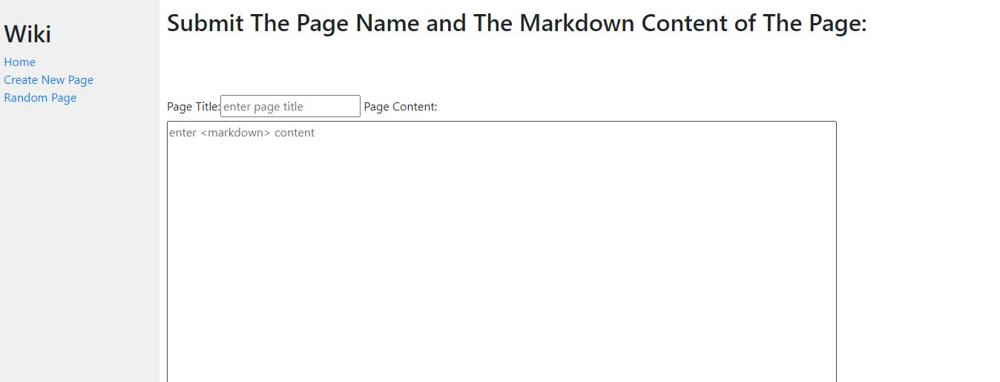

# Wiki
The website consists of a number of encyclopedia entries of various topics.Each encyclopedia entry can be viewed by visiting that entry’s page.
the user would be able to add new entries with the desired content.he would also be able to edit the content of any existed entry.
the website is providing a link that when is clicked would show a random entry from the existing entries.

## Snippets
| |
| :------------: |

| |
| :------------: |

| |
| :------------: |

| |
| :------------: |

## Requirements
- Python3

## Installation
- Clone the repository , use  `git@github.com:Omar-Hakem/Wiki.git` 
- #### open terminal and change the Directory to the project directory, use the following commands:
  ##### cd Wiki
  ##### python -m venv venv
  ##### venv/Scripts/activate
  ##### pip install -e 
  ##### python manage.py runserver
- then open your browser and enter the following url:
  ##### localhost:8000/encyclopedia

## Built With
- HTML
- CSS
- Python

## Author

## 👤 Omar Abd ElHakem
- GitHub: [@githubhandle](https://github.com/Omar-Hakem)
- LinkedIn: [LinkedIn](https://www.linkedin.com/in/omar-abd-elhakem-abd-elfattah94/)
